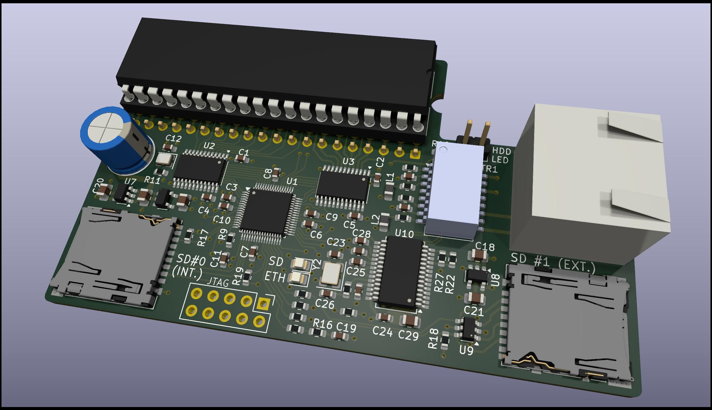
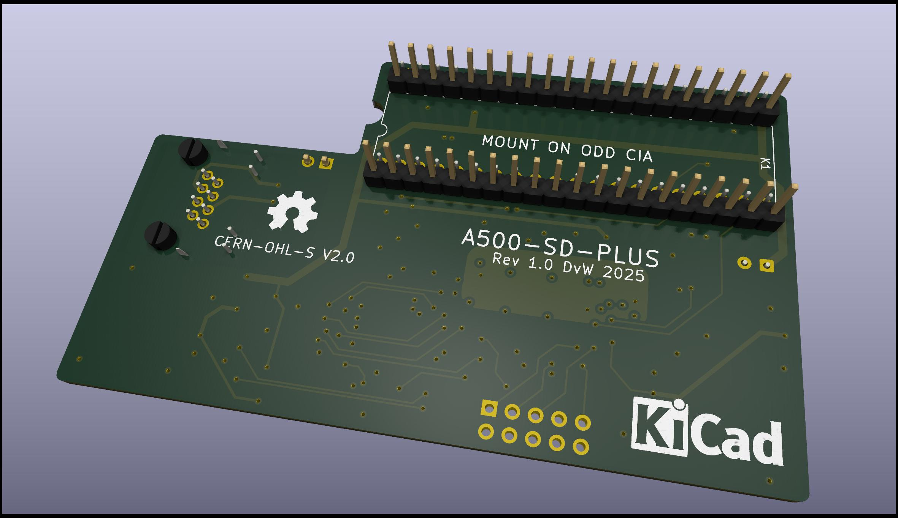
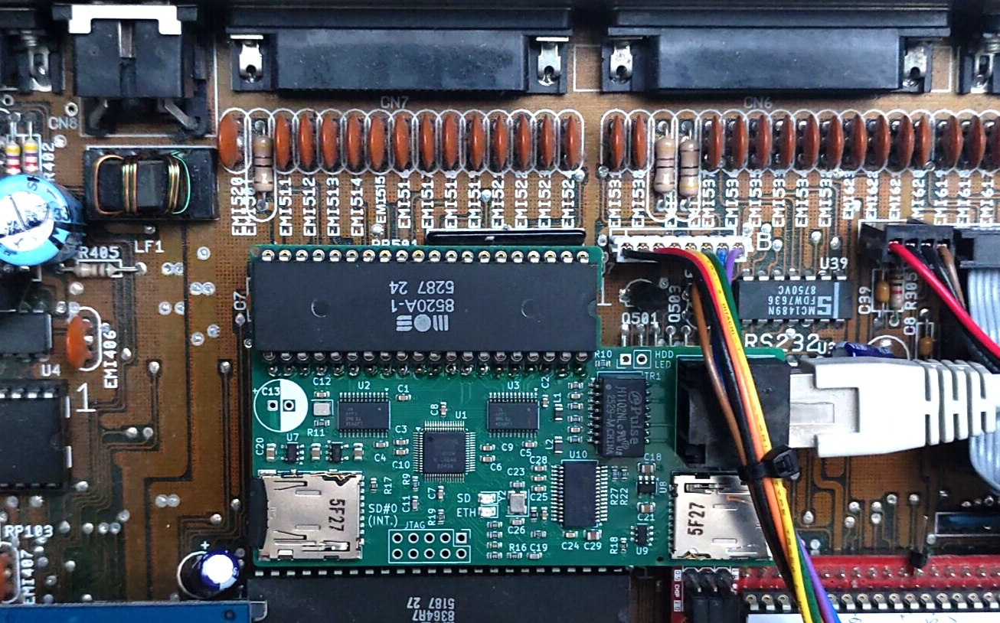
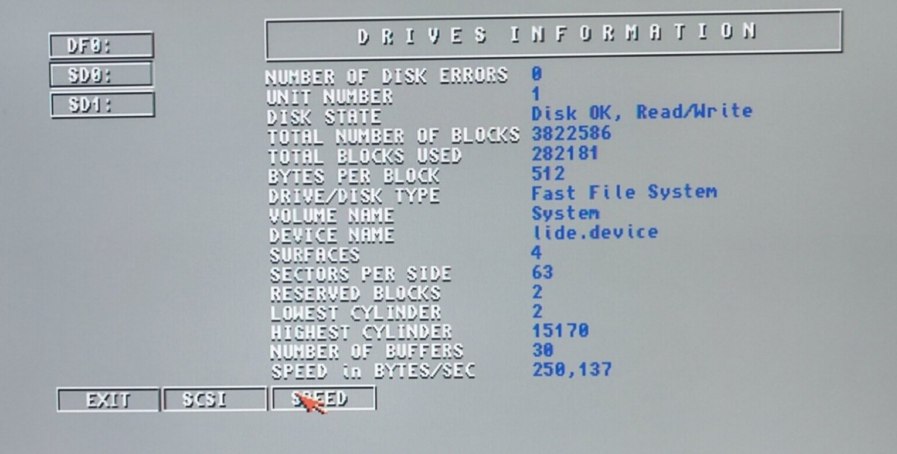

# a500-sd-plus-controller
This is a dual micro-SD card plus Ethernet controller for the Amiga 500.
The controller piggybacks on the odd CIA (CIA A) chip on the Amiga 500 motherboard.

## Table of Contents
* [Micro-SD](#micro-sd)
* [Ethernet](#ethernet)
* [Drivers](#drivers)
* [Performance](#performance)
* [Pictures](#pictures)

## Micro-SD
The two Micro-SD cards are operated in SPI mode.
Using the 68000 movep (move to/from peripheral) instruction the controller can read and write up to 450kB/s from and to the micro-SD card on a standard 7MHz 68000 CPU.

The primary channel is intended for internal use. This micro-SD card in this slot functions as a fixed harddisk. The secondary channel is intended to connect to an extension cable to hold a removable (hot-swappable) micro-SD card. 
For this purpose, proper measures are taken to control signal integrity over the extension cable. The controller can also handle any current surges that can occur during hot swapping without loading the Amiga power rail too much.

## Ethernet
The Ethernet controller is a Microchip ENC28J60 device.
This device supports a 10Mbit network connection.
The interface is built in a slightly non-standard way to maximum immunity for external interference.

## Drivers
The Micro-SD cards are supported by [sd-lide.device](https://github.com/Mathesar/sd_lide.device).

The Ethernet controller is supported by [enc28j60.device](https://github.com/Mathesar/enc28j60.device).

## Performance
On a standard Amiga 500 with a 7MHz 68000 CPU the following performance is reached:

* SysInfo reports 250kB/s read speed for the Micro-SD cards.
* The network reaches up to 22kB/s and is mostly limited by CPU speed.

Much better performance can be expected when a faster CPU is installed.

## Pictures

Proof that this was actually built:

And the obligatory SysInfo screenshot:

